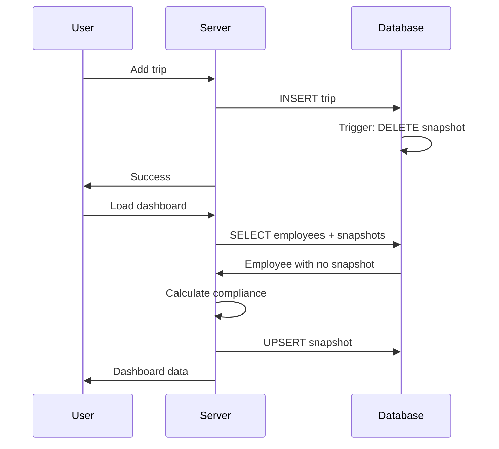

# ComplyEUR Cache Rules

This document defines the caching strategy for ComplyEUR v2.0, covering what is cached,
how long, what invalidates it, and who owns each cache layer.

## Cache Architecture Overview

```
┌─────────────────────────────────────────────────────────────────────┐
│                        CLIENT (Browser)                              │
│  - React Query / SWR (if used)                                      │
│  - Browser cache for static assets                                  │
└─────────────────────────────────────────────────────────────────────┘
                                │
                                ▼
┌─────────────────────────────────────────────────────────────────────┐
│                      NEXT.JS ROUTER CACHE                           │
│  - Prefetched routes (staleTimes: dynamic=30s, static=180s)        │
│  - RSC payload cache                                                │
└─────────────────────────────────────────────────────────────────────┘
                                │
                                ▼
┌─────────────────────────────────────────────────────────────────────┐
│                    REACT REQUEST CACHE                              │
│  - cache() function deduplicates within same request               │
│  - Zero TTL, invalidated after request completes                   │
└─────────────────────────────────────────────────────────────────────┘
                                │
                                ▼
┌─────────────────────────────────────────────────────────────────────┐
│                    DATABASE SNAPSHOT CACHE                          │
│  - employee_compliance_snapshots table                              │
│  - Invalidated by database triggers when trips change              │
└─────────────────────────────────────────────────────────────────────┘
                                │
                                ▼
┌─────────────────────────────────────────────────────────────────────┐
│                         SUPABASE                                    │
│  - trips, employees, profiles (source of truth)                    │
└─────────────────────────────────────────────────────────────────────┘
```

## Source of Truth Hierarchy

```
TRUTH:   trips table
         └── All trip data (entry_date, exit_date, country, ghosted, etc.)

DERIVED: employee_compliance_snapshots
         └── Precomputed from trips
         └── Invalidated by trip changes (database trigger)

DERIVED: Dashboard aggregates
         └── Computed from snapshots or live from trips
         └── Invalidated by page navigation / refresh
```

## Cache Layers

### 1. Next.js Router Cache (Client-side)

**Location:** Browser memory
**Owner:** Next.js Specialist
**Configuration:** `next.config.ts`

```javascript
experimental: {
  staleTimes: {
    dynamic: 30,  // 30 seconds for dynamic routes
    static: 180,  // 3 minutes for static routes
  },
}
```

| Route | Type | StaleTimes |
|-------|------|------------|
| `/dashboard` | Dynamic | 30 seconds |
| `/calendar` | Dynamic | 30 seconds |
| `/employee/[id]` | Dynamic | 30 seconds |
| `/exports` | Dynamic | 30 seconds |
| `/settings` | Dynamic | 30 seconds |
| `/login` | Static | 3 minutes |
| `/signup` | Static | 3 minutes |

**Invalidation:** Manual navigation, `router.refresh()`, or `revalidatePath()`

### 2. React Request Cache (Server-side)

**Location:** Server memory (per-request)
**Owner:** Next.js Specialist
**TTL:** Request duration only

Functions wrapped with `cache()`:
- `getEmployeesWithTrips()` - Employee list with nested trips
- `getEmployeeComplianceData()` - Employee compliance calculations
- `getEmployeeById(id)` - Single employee fetch
- `getEmployeeCount()` - Total employee count
- `getEmployeesWithSnapshots()` - Employees with cached compliance
- `getDashboardSummary()` - Dashboard metrics

**Purpose:** Prevent duplicate database calls when multiple components request the same data in a single page render.

**Invalidation:** Automatic - cache cleared after request completes.

### 3. Compliance Snapshot Cache (Database)

**Location:** `employee_compliance_snapshots` table
**Owner:** Supabase DBA + Algorithm Engineer
**TTL:** Indefinite until invalidated

Cached fields:
- `days_used` - Days used in 180-day window
- `days_remaining` - 90 minus days_used
- `risk_level` - green/amber/red
- `is_compliant` - Boolean
- `trips_hash` - Hash of trip data for validation

**Invalidation Triggers:**

| Event | Invalidates | Mechanism |
|-------|-------------|-----------|
| Trip INSERT | Employee snapshot | Database trigger |
| Trip UPDATE | Employee snapshot | Database trigger |
| Trip DELETE | Employee snapshot | Database trigger |
| Employee DELETE | Employee snapshot | CASCADE delete |
| Manual rebuild | Company snapshots | Admin action |

**Trigger SQL:**
```sql
CREATE TRIGGER trip_invalidates_snapshot
  AFTER INSERT OR UPDATE OR DELETE ON trips
  FOR EACH ROW
  EXECUTE FUNCTION invalidate_compliance_snapshot();
```

### 4. Algorithm Memoization (In-memory)

**Location:** Component memory (React useMemo)
**Owner:** Algorithm Engineer
**TTL:** Component lifetime

The `createComplianceCalculator()` function creates a memoized calculator that caches results based on:
- Trip data (hashed by id, dates, country)
- Reference date
- Calculation mode

**Usage:**
```typescript
const calculator = useMemo(() => createComplianceCalculator(), [])
const result = calculator(trips, { mode: 'audit', referenceDate: today })
```

**Invalidation:** Automatic when component unmounts.

## Staleness Tolerance by Screen

| Screen | Max Staleness | Rationale |
|--------|---------------|-----------|
| Dashboard | 30 seconds | Overview, updated frequently but not decision-critical |
| Employee List | 30 seconds | Similar to dashboard |
| Employee Detail | 0 (live) | Decisions made here, must be accurate |
| Calendar | 30 seconds | Visual planning, can tolerate slight staleness |
| Exports | 0 (live) | Audit trail, must be accurate at time of export |
| Settings | 3 minutes | Configuration data, rarely changes |

## Cache Invalidation Patterns

### Pattern 1: Trip Modification

When a trip is created, updated, or deleted:

1. Database trigger deletes employee's compliance snapshot
2. Next request for employee data finds no snapshot
3. System computes compliance live and stores new snapshot
4. Subsequent requests use cached snapshot



### Pattern 2: Bulk Operations

For operations affecting many employees:

1. Use background job queue
2. Job clears snapshots for affected employees
3. Job recalculates and stores new snapshots
4. Dashboard shows updated data on next load

### Pattern 3: Force Refresh

When user wants guaranteed fresh data:

1. Client calls `router.refresh()` or action with `revalidatePath()`
2. Server fetches fresh data (snapshots or live)
3. Client receives updated response

## Performance Budgets

| Metric | Target | Acceptable | Failure |
|--------|--------|------------|---------|
| Dashboard load (with snapshots) | <500ms | <1s | >2s |
| Dashboard load (computing live) | <2s | <3s | >5s |
| Snapshot cache hit rate | >90% | >80% | <70% |
| Database queries per dashboard | ≤2 | ≤3 | >5 |

## Monitoring

### Metrics to Track

1. **Snapshot cache hit rate** - % of employees with valid snapshots
2. **Cache miss latency** - Time to compute compliance when no snapshot
3. **Invalidation frequency** - How often snapshots are being invalidated
4. **Stale snapshot detection** - Snapshots with trips_hash mismatch

### Logging

Slow operations (>300ms) are logged with:
- Operation name
- Duration
- Metadata (employee count, etc.)

Cache events are tracked:
- `cache:compliance_snapshot:hit`
- `cache:compliance_snapshot:miss`

## Emergency Procedures

### If cache is serving stale data:

1. Check `trips_hash` matches current trip data
2. Run `rebuildCompanySnapshots(companyId)` for affected company
3. Verify snapshots are being invalidated by triggers

### If cache hit rate drops:

1. Check if triggers are firing (look at `snapshot_generated_at` timestamps)
2. Verify `invalidate_compliance_snapshot()` function exists
3. Check for errors in snapshot update process

### If dashboard is slow:

1. Check if snapshots exist (`missing_snapshots` in dashboard summary)
2. Trigger bulk snapshot rebuild if many are missing
3. Verify database indexes are being used (EXPLAIN ANALYZE)

## Testing Cache Behavior

### Unit Tests

```typescript
describe('Snapshot Cache', () => {
  it('invalidates snapshot on trip insert', async () => {
    const snapshot = await getSnapshot(employeeId)
    await createTrip({ employeeId, ... })
    const newSnapshot = await getSnapshot(employeeId)
    expect(newSnapshot).toBeNull() // Invalidated
  })

  it('rebuilds snapshot on dashboard load', async () => {
    await invalidateSnapshot(employeeId)
    await loadDashboard()
    const snapshot = await getSnapshot(employeeId)
    expect(snapshot).not.toBeNull() // Rebuilt
  })
})
```

### Integration Tests

1. Add trip → Verify dashboard shows updated data
2. Delete trip → Verify dashboard shows updated data
3. Concurrent edits → Verify no stale data served

## Version History

| Date | Version | Changes |
|------|---------|---------|
| 2026-01-09 | 1.0 | Initial cache rules documentation |
